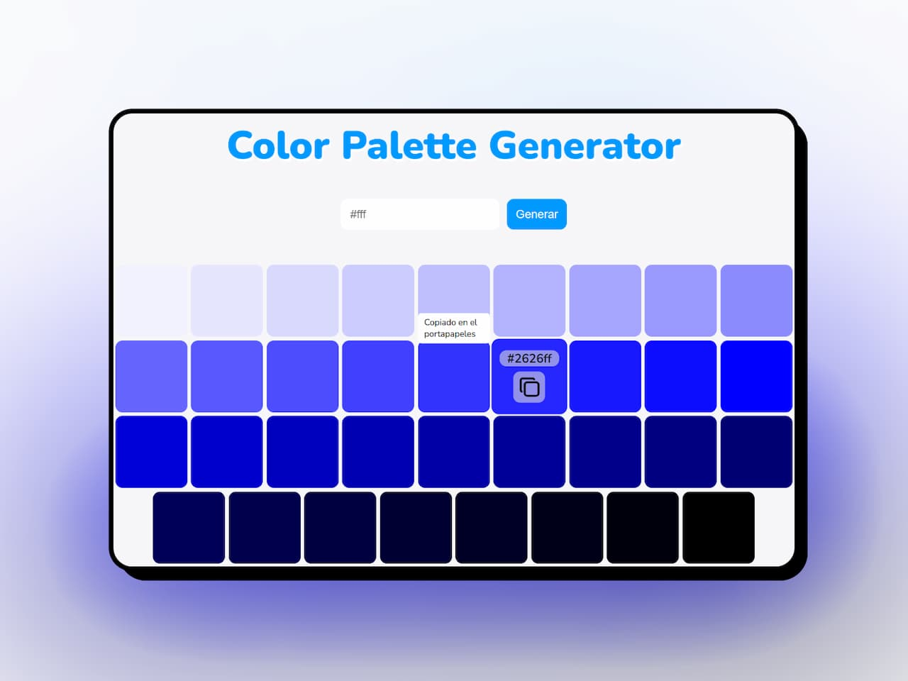

# Generador de paleta de colores

Herramienta para generar más de 20 tonalidades de un mismo color, partiendo de un **color base** con el fin de crear una paleta 🎨 que contenga una **armonía visual coherente**.

<h3 align="center">< seandsun /></h3>